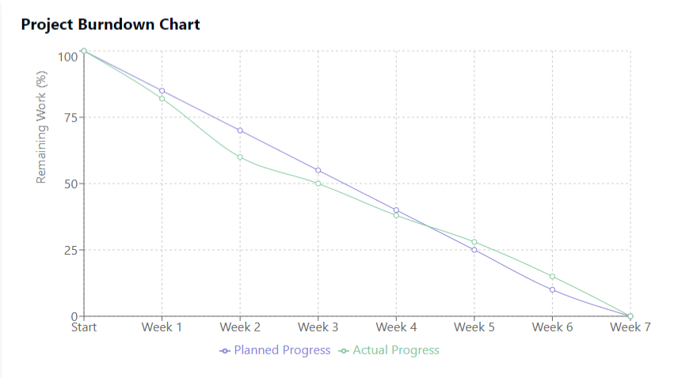
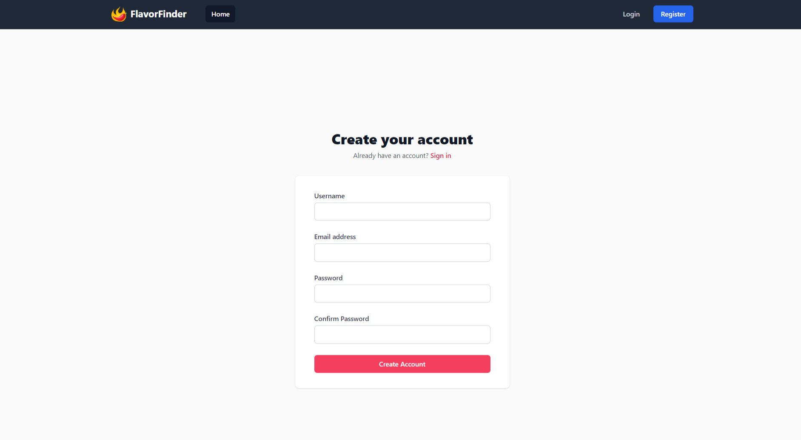

# FlavorFinder

[Website Link](http://restaurant-finder-frontend.s3-website.us-east-2.amazonaws.com/)

A modern restaurant discovery platform with advanced search capabilities and review system.


## Team Triad Members

### Shantanu Joshi
**Areas of Contribution:**
- Backend Development (Spring Boot)
  - REST API Implementation
  - JWT Authentication
  - Security Configuration
  - Exception Handling
  - Data Validation
- AWS EC2 Deployment & Configuration
  - Load Balancer Setup
  - Auto-scaling Configuration
  - Security Groups
- Database Design & Implementation
  - Schema Design
  - MySQL RDS Configuration
  - Query Optimization
- Frontend Development (React)
  - API Integration
  - TypeScript Implementation

### Danishbir Singh Bhatti
**Areas of Contribution:**
- Frontend Development (React)
  - Component Architecture
  - State Management
  - API Integration
  - Responsive Design
  - TypeScript Implementation
- Database Management
  - Query Writing
  - Data Modeling
  - Performance Optimization
- AWS S3 Configuration
  - Static Website Hosting
- Database Design & Implementation
  - Database Population
  - Query Optimization

## Technical Architecture

### Frontend Technologies
- React 18.2.0
- TypeScript 4.9.5
- Context API for State Management
- Axios for API Integration
- Material-UI Components
- React Router v6
- JWT Decode
- CSS Modules


### Backend Technologies
- Spring Boot 3.1.0
- Java 17
- Spring Security
- JWT Authentication
- JPA/Hibernate
- MySQL Connector
- Maven Build Tool
- Lombok
- Spring Boot Test

### API Endpoints

#### Authentication
```
POST /api/auth/register - User Registration
POST /api/auth/login - User Login
GET /api/auth/user - Get User Profile
```

#### Restaurants
```
GET /api/restaurants - List All Restaurants
GET /api/restaurants/{id} - Get Restaurant Details
GET /api/restaurants/search - Search Restaurants
POST /api/restaurants/{id}/reviews - Add Review
```

## Project Documentation

### UML Diagrams
- [UML Class Diagram](UML diagrams/RestaurantFinder_UML.png)
- [Deployment UML](UML diagrams/Deployment_UML.png)
- [Component UML](UML diagrams/Component_UML.png)

### Project Journal
Check our weekly progress and sprint details:
- 
- 

### Project Management
Track our progress:
- [JIRA Board](https://sjsu-grad-cmpe202.atlassian.net/jira/software/projects/SCRUM/summary)
- [Weekly Scrum Report](Docs/Weekly_Scrum_Reports.pdf)

## Development Setup

### Frontend Setup
```bash
# Clone repository
git clone [repository-url]

# Navigate to frontend directory
cd frontend

# Install dependencies
npm install

# Start development server
npm start
```

### Backend Setup
```bash
# Navigate to backend directory
cd backend

# Build project
mvn clean install

# Run application
mvn spring-boot:run
```

### AWS Configuration
```bash
# S3 Static Website
aws s3 mb s3://flavorfinder-frontend
aws s3 website s3://flavorfinder-frontend --index-document index.html

# EC2 Deployment
aws ec2 run-instances --image-id ami-xxxxx --instance-type t2.micro

# RDS Setup
aws rds create-db-instance --db-instance-identifier flavorfinder-db
```

## XP Core Values Maintained

### Communication

- Regular team meetings

- Clear documentation

- Collaborative problem-solving

- Effective task distribution

### Courage

- Adapted to team member departure

- Took on additional responsibilities

- Learned new technologies as needed

- Made tough architectural decisions

## Core Features Screenshots

### User Authentication



### Restaurant Search


### Restaurant Details


### Review System


## License
This project is developed for CMPE-202 at San Jose State University.
